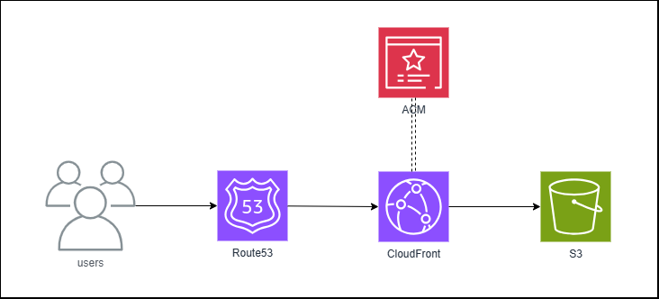

# AWS CloudFront + S3 Static Site Infrastructure as Code

Terraform で AWS 上に CloudFront と S3 を組み合わせた静的サイト配信インフラを構築します。

**特徴**: ✅ セキュア（OAC）| ✅ HTTPS | ✅ コスト最適化 | ✅ カスタムドメイン

## 構成図



詳細は `architecture.drawio` を [Draw.io](https://www.draw.io) で開いてください。

## 前提条件

- Terraform v1.6 以上
- AWS CLI v2
- AWS IAM ユーザー（S3, CloudFront, ACM, Route53 の管理権限）

## クイックスタート

```bash
# 1. デプロイ
terraform init
terraform plan
terraform apply
```

## DNS 設定

```bash
# Route53 ネームサーバーを取得
terraform output route53_nameservers

# ドメイン登録業者で NS レコードを設定
# DNS 反映: 24-48 時間
```

## CloudFront キャッシュクリア

```bash
DIST_ID=$(terraform output -raw cloudfront_distribution_id)
aws cloudfront create-invalidation --distribution-id $DIST_ID --paths "/*"
```

## リソース削除

```bash
aws s3 rm s3://$(terraform output -raw s3_bucket_name) --recursive
terraform destroy
```

## トラブルシューティング

| エラー | 原因 | 対応 |
|--------|------|------|
| 403 Forbidden | ファイルなし | `index.html` をアップロード |
| 404 Not Found | ファイル不在 | キャッシュをクリア、DNS確認 |
| HTTPS エラー | 証明書未発行 | 5-10分待機 |
| DNS 未反映 | NS設定未反映 | 24-48時間待機 |

## アーキテクチャ

### セキュリティ
- S3 パブリックアクセスブロック有効
- CloudFront OAC + AWS SigV4 署名
- HTTPS 強制（TLSv1.2+）

### コスト最適化
- CloudFront キャッシュ: 24時間（デフォルト）～ 1年（最大）
- Gzip 圧縮
- S3 バージョニング無効
- **月間コスト目安**: ~$1-2 USD（低トラフィック想定）

## ファイル構成

```
├── versions.tf          # Terraform バージョン
├── providers.tf         # AWS プロバイダー
├── variables.tf         # 入力変数
├── main.tf             # リソース定義
├── outputs.tf          # 出力値
├── architecture.drawio # 構成図
└── .gitignore          # Git 除外
```

## 参考資料

- [Terraform AWS Provider](https://registry.terraform.io/providers/hashicorp/aws/latest/docs)
- [S3 Origin Access Control](https://docs.aws.amazon.com/AmazonCloudFront/latest/DeveloperGuide/private-content-restricting-access-to-s3.html)
- [AWS CloudFront](https://docs.aws.amazon.com/cloudfront/)

## ライセンス

MIT License
